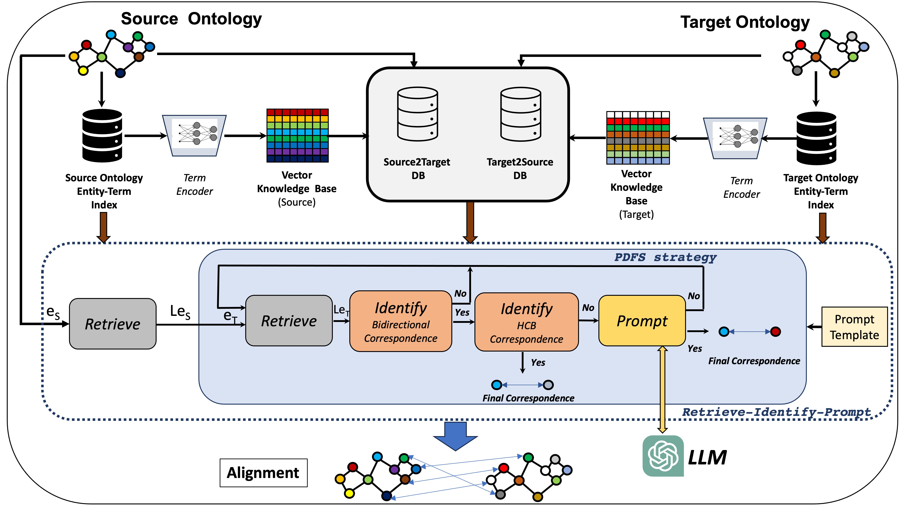

# MILA
MInimizing LLM Prompts in Ontology MApping

## Overview
MILA (MInimizing LLM Prompts in Ontology MApping), a framework designed to improve both the performance and efficiency of current LLM-based OM systems. 
MILA introduces a novel retrieve-identify-prompt pipeline, which adds an intermediate step to identify high-confidence bidirectional (HCB) correspondences with high precision. 
These correspondences are not queried to the LLM, reducing LLM interactions to only borderline cases. 
For these edge correspondences, MILA applies a prioritized depth-first search (PDFS) strategy, which iteratively queries the LLM for each identified bidirectional correspondence until a definitive match is confirmed. 
Although the overall time complexity remains consistent with current LLM-based OM systems, MILA significantly reduces execution time, especially when the retrieval system ranks the most relevant candidates first. 
To achieve efficiency gains, MILA’s retrieval system prioritizes correspondences between entities with the most semantically similar synonyms. 

https://papers.ssrn.com/sol3/papers.cfm?abstract_id=5074656

# 🔍 MILA: MInimizing LLM Prompts in Ontology MApping 

 


## Workflow
MILA consists of **two main steps**:

1️⃣ **Vector KB Construction & Mapping Prediction**  
   - Inputs: The source and target ontologies  
   - Outputs: Vector KB for each ontology (optional) & correspondence candidates  

2️⃣ **The Retrieve-Identify-Prompt Pipeline**  
   - Inputs: dataset of source entities to be mapped & correspondence candidates  
   - Outputs: Valid correspondences  


## ⚙️ Configuration

MILA uses a `config.yaml` file to customize parameters, and specify path to load all the data. 
You can modify this file to adjust
1) Ontology-related configurations and directory paths for various data files used in the ontology processing
2) Dataset-related configurations and paths
3) Prompt template-related paths
4) Correspondences-related configurations and paths
5) Configuration for ontology and dataset read methods defined by the user
6) Configuration for LLM access methods defined by the user

📂 Customizable Methods Folder
MILA includes a folder called user_methods where users can define their own functions to:
✅ Read ontologies in different formats (e.g., OWL, RDF, or custom formats).
✅ Query an LLM using different APIs or models.

This folder contains two key files:

read_methods.py: Handles ontology file reading.
LLM_methods.py: Defines how to interact with an LLM.


---

## 📦 Installation

1️⃣ **Clone the repository**  
```bash
git clone https://github.com/your-username/mila.git
cd mila
